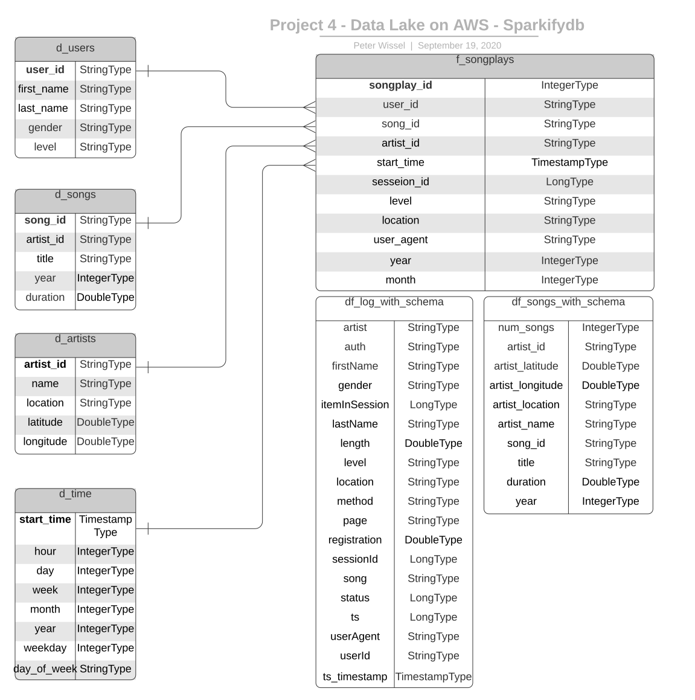

# Project 04 - Data Lake on AWS
> by Peter Wissel
>> 2020-09-19

## Introduction
A music streaming startup, Sparkify, has grown their user base and song database even more and want to move their 
data warehouse to a data lake. Their data resides in S3, in a directory of JSON logs on user activity on the app, as 
well as a directory with JSON metadata on the songs in their app.

As their data engineer, I'm tasked with building an ETL pipeline that extracts their data from S3, processes them 
using Spark, and loads the data back into S3 as a set of dimensional tables. This will allow their analytics team to 
continue finding insights in what songs their users are listening to.

I'll be able to test the database and ETL pipeline by running queries given to me by the analytics team from Sparkify 
and compare my results with their expected results.

## Project Description
In this project, I'll apply what I've learned on Spark and data lakes to build an ETL pipeline for a data lake hosted 
on S3. To complete the project, I will need to load data from S3, process the data into analytics tables using Spark, 
and load them back into S3. I'll deploy this Spark process on a cluster using AWS.

# Project Datasets

I'll be working with two datasets that reside in S3. Here are the S3 links for each:

    Song data         : s3://udacity-dend/song_data
    Log data          : s3://udacity-dend/log_data

## Song Dataset
The first dataset is a subset of real data from the [Million Song Dataset](https://labrosa.ee.columbia.edu/millionsong/). 
Each file is in JSON format and contains metadata about a song and the artist of that song. The files are partitioned by 
the first three letters of each song's track ID. For example, here are filepaths to two files in this dataset.

    song_data/A/B/C/TRABCEI128F424C983.json
    song_data/A/A/B/TRAABJL12903CDCF1A.json

And below is an example of what a single song file, `TRAABJL12903CDCF1A.json`, looks like.

    {"num_songs": 1, "artist_id": "ARJIE2Y1187B994AB7", "artist_latitude": null, "artist_longitude": null, "artist_location": "", "artist_name": "Line Renaud", "song_id": "SOUPIRU12A6D4FA1E1", "title": "Der Kleine Dompfaff", "duration": 152.92036, "year": 0}

## Log Dataset
The second dataset consists of log files in JSON format generated by this 
[event simulator](https://github.com/Interana/eventsim) based on the songs in the dataset above. These simulate app 
activity logs from an imaginary music streaming app based on configuration settings.

The log files in the dataset I'll be working with are partitioned by year and month. For example, here are filepaths 
to two files in this dataset.

    log_data/2018/11/2018-11-12-events.json
    log_data/2018/11/2018-11-13-events.json

And below is an example of what the data in a log file, `2018-11-12-events.json`, looks like.

# Files

The project comprises a total of seven files. Four of these are optional Jupyter notebooks for development purposes:

* Step 1: `README.md` provides an introduction to this project.

* Step 2: `etl.py` reads and processes files from song_data and log_data and loads them into the dimensional star schema 
tables.  

* Step 3: `dl.cfg` contains the whole configuration parameters of this project.

**Optional files:** The following three Jupyter notebook files are to pre-develop the necessary steps for processing the 
song- and log-data. 

* Step 4: `01_Project4-DataLake_JupyterNB_process_song_data.ipynb`  Steps to process song-data. Pre-Build d_songs and 
d_artists dimensional tables out of it.
    
* Step 5: `02_Project4-DataLake_JupyterNB_process_log_data.ipynb` Steps to process log-data. Pre-Build d_users and 
d_time dimension tables out of it.

* Step 6: `03_Project4-DataLake_JupyterNB_create_f_songplays_table.ipynb` Steps to process both above data sets. 
Pre-Build fact table f_songplays out of it. 

* Step 7: `04_execute_etl_script_on_EMR.txt`-file describes everything to execute the `etl.py` on an AWS cluster with 
two worker nodes 

* Step 8: `execution_log_local.txt`, `execution_log_cluster.log` and `execution_log_cluster_repartition.log` contains 
log entries from `etl.py`. This was done to measure the execution time in a local environment, cloud environment and 
cloud environment with a repartitioned data frame to two worker nodes. The result shows that the repartition-job is 30 
minutes shorter than the "normal" one.

# Database Schema for Song Play Analysis

For fast aggregation and simplified queries for the songplay analysis I created a denormalized star schema, based on the 
song and log datasets. This includes one fact table on songplays (`f_songplays`) and four dimension tables for users 
(`d_users`), songs (`d_songs`), artists (`d_artists`) and time (`d_time`). The two *staging* data frames 
(`df_log_with_schema`, `df_songs_with_schema`) are to prepare the result tables out of it.   
  

# ETL Pipeline

### What stands ETL for?
**ETL** stands for **E**xtract **T**ransform and **L**oad which is the general procedure to copy source data into a 
destination system which represents the data differently from, or in a different context than, the sources.

## How are the files executed
- Step 1: Prepare the source data (`song_data`, `log_data`) using the above described steps 4 to 6 from *Files* section. 

- Step 2:  The configuration is written in file `dl.cfg`. Everything inside is in ini-format style.

- Step 3:  `etl.py` is the main program to process the data pipeline and build the dimension and fact tables for the 
requested analytical Star-Schema. The data source and destination folders resides on AWS S3.

- Step 4:  `execution_log_local.txt` shows logging information during `etl.py` execution. This is valuable because you 
can see which part of the program is executed at the moment.

- Step 5: Create an AWS cluster (look at Step 6)

- Step 6: Execute all commands described in file `04_execute_etl_script_on_EMR.txt` to run `etl.py` on AWS cluster. 
After a *long time (> 2 hours)* the execution should be finished.
  
- Step 7: After execution don't forget to terminate the cluster with command: 

    `$aws emr terminate-clusters --cluster-id j-EXAMPLECLUSTERID`

- Step 8: You're done :-)
