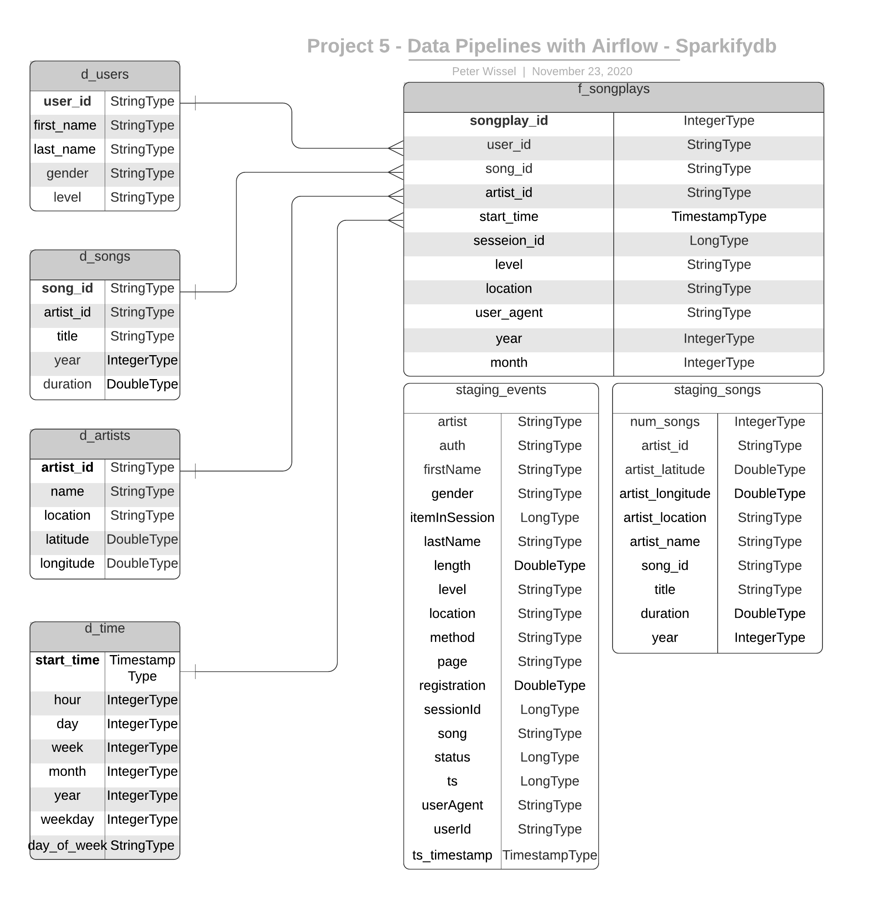

# Project 05 - Data Pipelines with Airflow
> by Peter Wissel
>> 2020-11-23

## Introduction
A music streaming company, Sparkify, has decided that it is time to introduce more automation and monitoring to their 
data warehouse ETL pipelines and come to the conclusion that the best tool to achieve this is Apache Airflow.
They have decided to bring me into the project and expect me to create high grade data pipelines that are dynamic and 
built from reusable tasks, can be monitored, and allow easy backfills. They have also noted that the data quality plays 
a big part when analyses are executed on top the data warehouse and want to run tests against their datasets after the 
ETL steps have been executed to catch any discrepancies in the datasets.
The source data resides in S3 and needs to be processed in Sparkify's data warehouse in Amazon Redshift. The source 
datasets consist of JSON logs that tell about user activity in the application and JSON metadata about the songs the 
users listen to.

## Project Overview
This project will introduce me to the core concepts of Apache Airflow. To complete the project, I'll need to create 
my own custom operators to perform tasks such as staging the data, filling the data warehouse, and running checks on 
the data as the final step.
They have provided me with a project template that takes care of all the imports and provides four empty operators that 
need to be implemented into functional pieces of a data pipeline. The template also contains a set of tasks that need 
to be linked to achieve a coherent and sensible data flow within the pipeline.
I'll be provided with a helpers class that contains all the SQL transformations. Thus, I won't need to write the 
ETL by myself, but I'll need to execute it with my custom operators.

## Datasets
For this project I will work with two data sets. Here are the S3 links for both:

- Log data: `s3://udacity-dend/log_data`
- Song data: `s3://udacity-dend/song_data`

### Project Template
First I get started with the prepared template to take care of all the imports and operators to use. The prepared 
template code consists of empty shells to fill with useful content.

The project template package contains three major components for the project:

- The dag template has all the imports and task templates in place, but the task dependencies have not been set
- The operators folder with operator templates
- A helper class for the SQL transformations

2. With these template files, I'm able see the a new DAG in the Airflow UI. The graph view look like this:

I'm able to execute the DAG successfully, but if I check the logs, I will see only `operator not implemented` messages.

#### Configuring the DAG

The DAG has `default parameters` according to these guidelines

    - The DAG does not have dependencies on past runs --> `'depends_on_past': False`
    - On failure, the task are retried 3 times        --> `'retries': 3`
    - Retries happen every 5 minutes                  --> `'retry_delay': timedelta(minutes=5)`
    - Catchup is turned off                           --> `catchup=False`
    - Do not email on retry                           --> `'email_on_retry': False`

In addition, I configure the task dependencies so that after the dependencies are set, the graph view follows the flow 
shown in the image below.

### Custom Operators
To complete the project, I need to build four different operators that will stage the data, transform the data, and 
run checks on data quality.
All of the operators and task instances will run SQL statements against the Redshift database. However, using parameters 
wisely will allow me to build flexible, reusable, and configurable operators I can later apply to many kinds of data 
pipelines with Redshift and with other databases.

#### Stage Operator
The stage operator is expected to be able to load any JSON formatted files from S3 to Amazon Redshift. The operator 
creates and runs a SQL COPY statement based on the parameters provided. The operator's parameters should specify where 
in S3 the file is loaded and what is the target table. The parameters should be used to distinguish between JSON file. 
Another important requirement of the stage operator is containing a templated field that allows it to load timestamped 
files from S3 based on the execution time and run backfills.

#### Fact and Dimension Operators
With dimension and fact operators, I can utilize the provided SQL helper class to run data transformations. Most of 
the logic is within the SQL transformations and the operator is expected to take as input a SQL statement and target 
database on which to run the query against. I can also define a target table that will contain the results of the 
transformation. Dimension loads are often done with the truncate-insert pattern where the target table is emptied before 
the load. Thus, I could also have a parameter that allows switching between insert modes when loading dimensions. Fact 
tables are usually so massive that they should only allow append type functionality.

#### Data Quality Operator
The final operator is to create the data quality operator, which is used to run checks on the data itself. The operator's 
main functionality is to receive one or more SQL based test cases along with the expected results and execute the tests. 
For each the test, the test result and expected result needs to be checked and if there is no match, the operator should 
raise an exception and the task should retry and fail eventually.

## Database Schema for Song Play Analysis
For fast aggregation and simplified queries for the songplay analysis I created a denormalized star schema, based on the 
song and log datasets. This includes one fact table on songplays (`f_songplays`) and four dimension tables for users 
(`d_users`), songs (`d_songs`), artists (`d_artists`) and time (`d_time`). The two *staging* data tables 
(`staging_events`, `staging_songs`) are to prepare the result tables out of it.   
  

