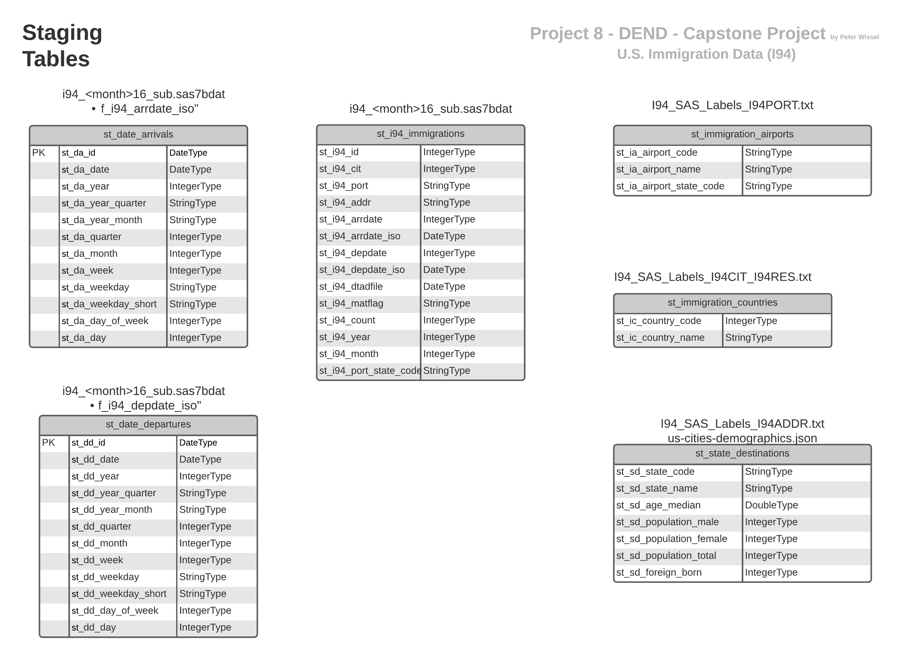
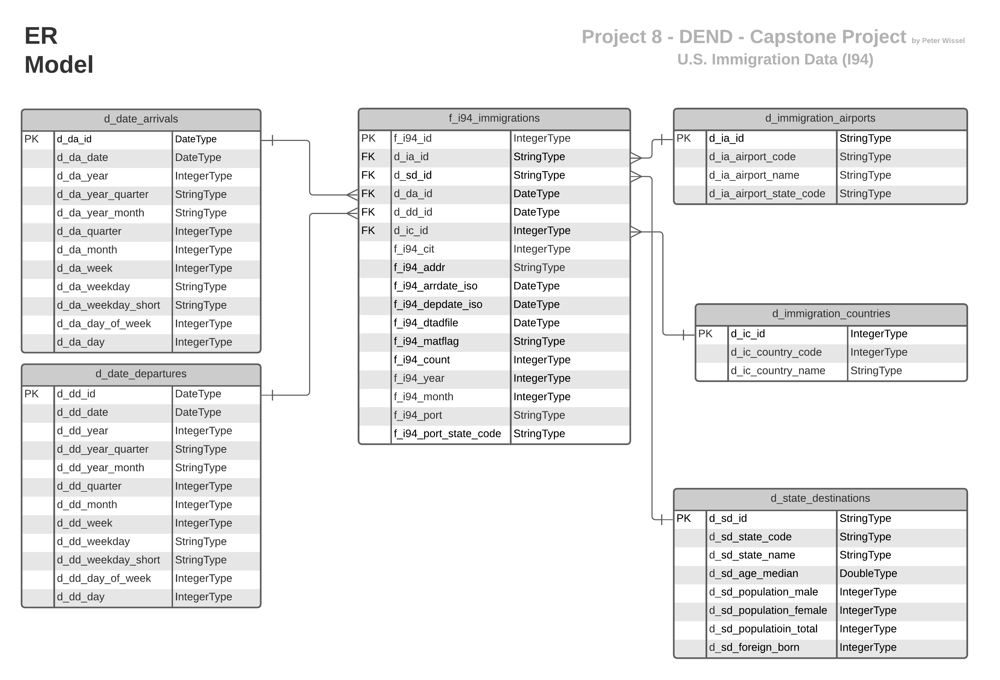

# Project 08 - Data Engineering Capstone Project
> by Peter Wissel
>> 2021-05-05

## Introduction
This project works on a data set for immigration to the United States. The supplementary datasets will include data on 
airport codes, U.S. city demographics, and temperature data. 

### Purpose of this project is to answer the following questions based on the given data sets:

1. From which country do immigrants come to the U.S.?
2. At which airport do foreign people arrive to immigrate to the U.S.?
3. To which state in the U.S. do immigrants want to continue after their initial arrival?
4. What demographics can immigrants expect once they arrive in the destination U.S. state, such as average temperature, 
   population numbers or population density?

## Project Datasets
The project works primarily with a dataset based on immigration data (I94) to the United States.

- Gathering Data (given data sets):
    1. [Immigration data '18-83510-I94-Data-2016' to the U.S.](https://travel.trade.gov/research/programs/i94/description.asp)
    2. [airport-codes_csv.csv: Airports around the world](https://datahub.io/core/airport-codes#data)
    3. [us-cities-demographics.csv: US cities and it's information about citizens](https://public.opendatasoft.com/explore/dataset/us-cities-demographics/export/)
    4. [GlobalLandTemperaturesByCity.csv: Temperature grouped by City and Country](https://www.kaggle.com/berkeleyearth/climate-change-earth-surface-temperature-data)

### Findings about input data
#### Findings from Immigration data (`18-83510-I94-Data-2016`) to the U.S.:

###### 1. `i94cit`:
- County Code does not match to `iso-3166`-Country-Code for further analysis
- Null values in column `i94cit`

###### 2. `i94port`:
- Airport Code `i94port` does not correspondent to [IATA](https://en.wikipedia.org/wiki/International_Air_Transport_Association)
3 letter airport codes from file [I94_SAS_Labels_I94PORT.txt](P8_capstone_resource_files/I94_sas_labels_descriptions_extracted_data/I94_SAS_Labels_I94PORT.txt).
**Project decision**: Only usage of given i94 airport codes.

###### 3. `arrdate` / `depdate`:
- `arrdate` and `depdate` are in SAS date format (String), whose epoch starts on 1960-01-01. This date values will be converted into DateFormat.

###### 4. `i94addr`:
- Null values in column `i94addr`

###### 5. [I94_SAS_Labels_I94ADDR.txt.I94ADDR](P8_capstone_resource_files/I94_sas_labels_descriptions_extracted_data/I94_SAS_Labels_I94ADDR.txt):
- `I94ADDR` State description has errors like 'WI'='WISCONS**O**N' instead of 'WI'='WISCONS**I**N'. **Project decision:**
The only incorrect US state will be corrected **manually**.

# Data Model and ETL Pipeline
### Conceptual Data Model
The following data model is based on the four main questions to be answered. For this reason, I decided to select only
the fields from the source data that provide the correct answers. After the data has been read in and written to the
staging tables for transformation, a star data model will be created for data analysis. Note: This project is not large 
enough to store the data in a core data warehouse (3NR) as a preliminary stage.

### What stands ETL for?
**ETL** stands for **E**xtract **T**ransform and **L**oad which is the general procedure to copy source data into a 
destination system which represents the data differently from, or in a different context than, the sources.

### Mapping Out Data Pipelines
Here is the list of steps to pipeline the data into the chosen data model to answer the project questions.

The following explanation shows an example of the procedure for processing an ETL data pipeline. This always works the 
same way like in this scenario:
1. Clean data and create staging table `st_<staging_table_name>` from source file.
1. Creation of a fact table named `f_<fact_table_name>` based on staging table `st_<staging_table_name_fact>`.
1. Creation of a dimension named `d_<dimension_table>` based on staging table `st_<staging_table_name_dimension>`.
1. Mapping of dimension `d_<dimension_table>` to  fact table `f_<fact_table_name>` 
1. Answer Project Question

**P8 Data Preparation:** This procedure is explained in more detail in the following data preparation Steps based on 
jupyter notebooks:

* Step 1 and 2: Project Overview, Scope and Gathering of Data 
  ([Link](P8_capstone_project/P8_Capstone_Project_Data_Preparation_Step_1_and_2.ipynb))
* Step 3.0 and 4.0: Data Model definition and ETL steps 
  ([Link](P8_capstone_project/P8_Capstone_Project_Data_Preparation_Step_3.0_and_4.0.ipynb))
* Step 3.1.1 and 4.1.1: Project Question 1 (PQ1) - From which country do immigrants come to the U.S. and how many? 
  ([Link](P8_capstone_project/P8_Capstone_Project_Data_Preparation_Step_3.1.1_and_4.1.1.ipynb))
* Step 3.1.2 and 4.1.2: Project Question 2 (PQ2) - At what airports do foreign persons arrive for immigration to the U.S.? 
  ([Link](P8_capstone_project/P8_Capstone_Project_Data_Preparation_Step_3.1.2_and_4.1.2.ipynb))
* Step 3.1.3 and 4.1.3: Project Question 3 (PQ3) - At what times do foreign persons arrive for immigration to the U.S.? 
  ([Link](P8_capstone_project/P8_Capstone_Project_Data_Preparation_Step_3.1.3_and_4.1.3.ipynb))
* Step 3.1.4 and 4.1.4: Project Question 4 (PQ4) - To which states in the U.S. do immigrants want to continue their travel after their initial 
  arrival and what demographics can immigrants expect when they arrive in the destination state, such as average 
  temperature, population numbers or population density? 
  ([Link](P8_capstone_project/P8_Capstone_Project_Data_Preparation_Step_3.1.4_and_4.1.4.ipynb))
* Step 4.2: Data quality checks 
  ([Link](P8_capstone_project/P8_Capstone_Project_Data_Preparation_Step_4.2_data_quality_checks.ipynb))
* Step 4.3: Data dictionary 
  ([Link](P8_capstone_project/P8_Capstone_Project_Data_Preparation_Step_4.3_data_dictionary.ipynb))

### Data Dictionary
A data dictionary describes and explains all available tables and fields. This file is created automatically, persisted 
in JSON format and can be found here:

**Only** Star Model:
* [P8_capstone_documentation_data_dictionary_only_star_model.json](P8_capstone_documentation/project_data_dictionary/P8_capstone_documentation_data_dictionary_only_star_model.json)

All available tables during ETL data pipeline creation process. Please note: only the Star Model elements are described. 
* [P8_capstone_documentation_data_dictionary.json](P8_capstone_documentation/project_data_dictionary/P8_capstone_documentation_data_dictionary.json)

### What is part of the data preparation process (ETL)?

**This Project has two scripts:**

* **Script 1: P8_Capstone_Project_ETL_Processing_Data.py:**
[P8_Capstone_Project_ETL_Processing_Data.py](P8_capstone_project/P8_Capstone_Project_ETL_Processing_Data.py) 

* **Script 2: P8_Capstone_Project_ETL_Processing_Data.cfg** 
[P8_Capstone_Project_ETL_Processing_Data.cfg](P8_capstone_project/P8_Capstone_Project_ETL_Processing_Data.cfg)

Script 1 does all steps to build the final star data model.
Script 2 is the configurations file for the Script 1.

### Prerequisites

* **Python3** is recommended as the environment. Get more information about the Python installation on page
  [https://www.python.org](https://www.python.org/)

Also, the following libraries are needed for the python environment to make Jupyter Notebook and Apache Spark to work:

* _pyspark_ (+ dependencies) to enable script to create a SparkSession. (See 
  [https://spark.apache.org/docs/latest/api/python/index.html](https://spark.apache.org/docs/latest/api/python/index.html))
* NOTE: in the beginning of the execution, script downloads saurfang:spark-sas7bdat package to enable Spark to process 
  SAS files.

* _pathlib_ to handle path's operations on the file system  
* _json_ to persist a dataset in JSON format
* _configparser_ to configure all parameters from *.cfg file

### Run ETL pipeline

Type to command line:

`python3 P8_Capstone_Project_ETL_Processing_Data.py`

* All the environment variables are configured in an array and then the Spark session is created. During this process, 
  the configuration file is read ([P8_Capstone_Project_ETL_Processing_Data.cfg](./P8_capstone_project/P8_Capstone_Project_ETL_Processing_Data.cfg)) 
* Source data is read from SAS-I94 files and written to parquet files.
* The project questions are called as by means of the parameters (`'pq1','pq2', 'pq3', 'pq4'`). Everything else is done 
  by the underlying functions. Example: When a method is called to create a dimension that is not currently available, 
  it is loaded. If there is nothing to load because it has not been created yet, it will be created.     

### Project write-up
* Outline of the steps taken in this project:
    * Project scope: Four project questions had to be answered.
    * The four given data sets from different areas were examined and aligned with the project questions. Based on these 
      questions, the data model was built step by step.
    * Examination of the data provided important insights. Pandas were used to take a quick look at small data sets to 
      gain these insights.
    * Transformation of the data within the ETL (Extract, Transform, Load) pipeline to build the star schema data model.
    * Automatically creation of a data dictionary. The only manual part was to fill the table and column descriptions.

* Purpose of the final data model:
    * At the beginning there were 4 project questions that had to be answered. Based on these questions, the data model
      was built step by step to the final star data model.

* Used technologies and tools:
    * This project uses Python, Pandas, Jupyter Notebook and Apache Spark (PySpark) in local mode to process 2016 U.S. 
      immigration data.
      There are 4 project questions to answer. The ETL pipeline described is always aligned with the questions to be
      answered. The data model therefore evolves piece by piece to the final version. The specified tools were selected
      because, on the one hand, they are easily suitable for data analysis and preparation. If the requirements become
      larger and the amount of data increases, a switch to cloud technologies based on e.g. AWS is possible at any time.
      However, this is **not** the scope of this project.

* A logical approach to this project under the following scenarios:
    * __Propose how often the data should be updated and why.__
        * The ETL process should run on a monthly basis.. This decision was made due to the fact that SAS data is only 
          provided monthly.

    * __Write a description of how you would approach the problem differently under the following scenarios:__
        * __The data was increased by 100x.__
            * Source data should be stored in Cloud storage like AWS S3
            * To process all data in parallel use clustered Spark nodes (AWS EMR)
            * Storing the calculated data in a Star Model data structure within a cloud-based data warehouse (DWH) such as 
              AWS Redshift, is possible. Optionally, it is also conceivable to store the Star Data Model as Parquet files in 
              S3 cloud storage for further analysis. 
            
        * __The data populates a dashboard that must be updated on a daily basis by 7am every day.__
            * The I94 source data should be read in daily. This will reduce the amount of data per run. Note that not every
              project dataset (e.g. US Cities Demographics or Airport Codes) needs to be loaded daily.
            * Apache Airflow could be used for the daily data loading procedure
    
        * __The database needed to be accessed by 100+ people.__
            * Output data should be stored in a cloud DWH such as AWS Redshift to be "always available".  In addition, there
              is the possibility that the data in the Star data model is made available to the user for self-selection through
              self-service BI. Tools such as QlikSense or similar can be used here.

## Summary
Project-Capstone provides tools to automatically process, clean, analyze US I94 Immigration data in a flexible way and
help to answer questions like the four Project questions.

##### Hint: Call the script on a cluster with the given package:

        !spark-submit --packages saurfang:spark-sas7bdat:2.1.0-s_2.11 script.py

