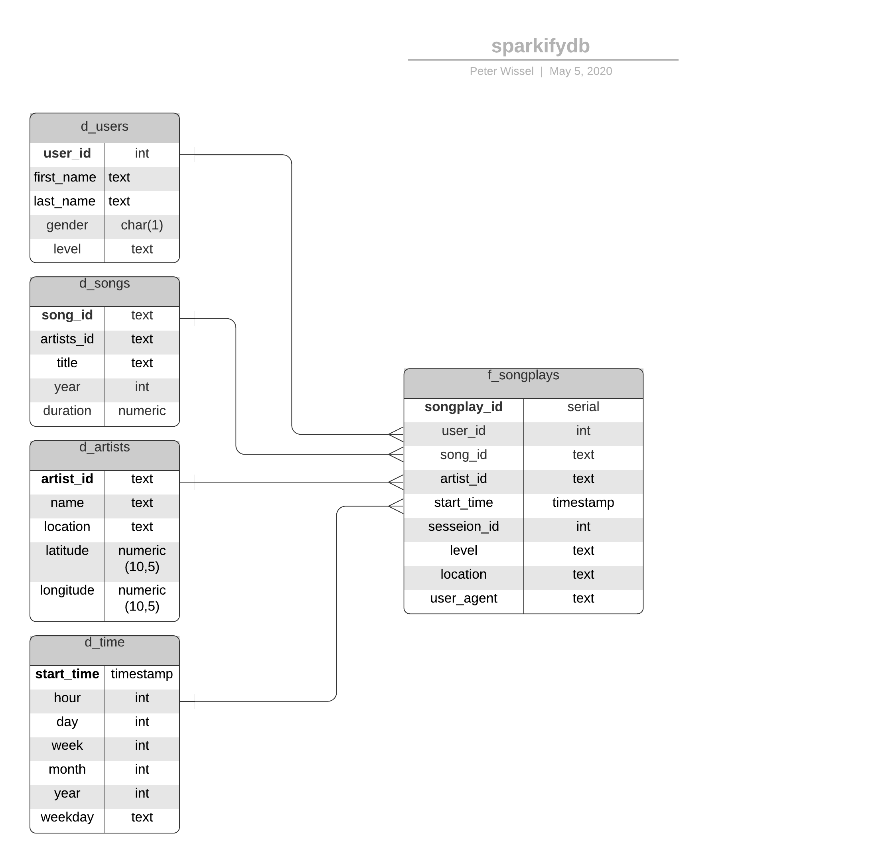
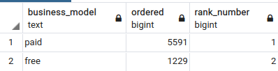
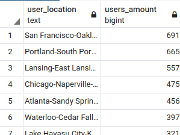
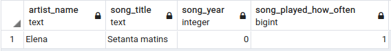

# Project: Data Modeling with Postgres
> by Peter Wissel
>> 2020-05-05

##Introduction

A startup called Sparkify wants to analyze the data they've been collecting on songs and user activity on their new 
music streaming app. The analytics team is particularly interested in understanding what songs users are listening to. 
Currently, they don't have an easy way to query their data, which resides in a directory of JSON logs on user activity 
on the app, as well as a directory with JSON metadata on the songs in their app.

They'd like a data engineer to create a Postgres database with tables designed to optimize queries on song play analysis. 
His role is to create a database schema and ETL pipeline for this analysis. He'll be able to test his database and ETL 
pipeline by running queries given to him by the analytics team from Sparkify and compare his results with their 
expected results.

## Project Description

In this project, I applied what I've learned on data modeling with Postgres and build an ETL pipeline using Python. 
To complete the project, I needed to define fact and dimension tables for a star schema for a particular analytic 
focus, and wrote an ETL pipeline that transfers data from files in two local directories into these tables in Postgres 
using Python and SQL.

# Datasets

## Song Dataset

The first dataset is a subset of real data from the [Million Song Dataset](http://millionsongdataset.com/ 
"The Million Song Dataset is a freely-available collection of audio features and metadata for a million contemporary 
popular music tracks"). Each file is in JSON format and contains metadata about a song and the artist of that song. 
The files are partitioned by the first three letters of each song's track ID. For example, here are filepaths to two 
files in this dataset:

    song_data/A/B/C/TRABCEI128F424C983.json
    song_data/A/A/B/TRAABJL12903CDCF1A.json

And below is an example of what the data in a log file, 2018-11-12-events.json, looks like:

    {"num_songs": 1, "artist_id": "ARJIE2Y1187B994AB7", "artist_latitude": null, "artist_longitude": null, "artist_location": "", "artist_name": "Line Renaud", "song_id": "SOUPIRU12A6D4FA1E1", "title": "Der Kleine Dompfaff", "duration": 152.92036, "year": 0}

## Log Dataset

The second dataset consists of log files in JSON format generated by this [event simulator](https://github.com/Interana/eventsim 
"Event data simulator. Generates a stream of pseudo-random events from a set of users, designed to simulate web traffic.") 
based on the songs in the dataset above. These simulate activity logs from a music streaming app based on specified 
configurations.

The log files in the dataset I was working with are partitioned by year and month. For example, here are filepaths 
to two files in this dataset.

    log_data/2018/11/2018-11-12-events.json
    log_data/2018/11/2018-11-13-events.json
    
And below is an example of what the data in a log file, 2018-11-12-events.json, looks like:

# Files

In addition to the data files, the project includes six files:

1. `test.ipynb` displays the first few rows of each table to let me check my database.

2. `create_tables.py` drops and creates tables. I run this file to reset my tables before each time I run the ETL 
    scripts.

3. `etl.ipynb` reads and processes a single file from song_data and log_data and loads the data into the tables. This 
    notebook contains detailed instructions on the ETL process for each of the tables.

4. `etl.py` reads and processes files from song_data and log_data and loads them into the tables. It's based on my work 
    in the ETL notebook.

5. `sql_queries.py` contains all my sql queries, and is imported into the last three files above.

6. `README.md` provides an introduction to this project.

# Database Schema for Song Play Analysis

For fast aggregation and simplified queries for the songplay analysis I created a denormalized star schema, based on the 
song and log datasets. This includes one fact table on songplays (`f_songplays`) and four dimension tables for users 
(`d_users`), songs (`d_songs`), artists (`d_artists`) and time (`d_time`).
  

    
# ETL Pipeline

**ETL** stands for **E**xtract **T**ransform and **L**oad which is the general procedure to copy source data into a 
destination system which represents the data differently from, or in a different context than, the sources.

## Data Extraction and Transformation

The ETL pipeline extracts data from files in two directories: 

    data/song_data
    data/log_data
    
After this the data will be transformed and loaded into the five tables of the sparkifydb database. This is handeled by 
four files using Python and SQL. Running `create_tables.py` creates and initializes the tables for the sparkifydb 
database with the help of the file `sql_queries.py`.  
Running `test.ipynb` confirms the creation of my tables with the correct columns. Running `etl.ipynb` develops ETL processes
for each table and is used to prepare a python script (`etl.py`) for processing all the datasets. `sql_queries.py` contains
all the SQL queries and is imported into `create_tables.py`, `etl.ipynb` and `etl.py`.

## Loading the Data and Running ETL Pipeline

All the code I wrote in `etl.ipynb` I then used to complete `etl.py`, which reads and processes all the 
files from the song_data and log_data directories, and loads them into the sparkifydb database tables.

The steps to run the pipeline are as follows:

1. In a terminal, run `python3 create_tables.py` to reset the tables in the sparkifydb database.
2. Running `test.ipynb` (in a jupyter notebook) confirms that the tables were successfully created with 
   the correct columns.
3. In a terminal, run `python3 etl.py` to process all the datasets.
4. Again, running `test.ipynb` confirms that the records were successfully inserted into each table.

## Query examples

##### Which business model is better received by customers?

    select  distinct level as business_model
           ,count(1) as ordered
           ,RANK () OVER ( 
                          ORDER BY count(1)  desc
                          ) rank_number 
      from f_songplays
     group by level
     order by rank_number;

 

 

##### Where do our listeners come from?

     select location as user_location
           ,count(1) as users_amount
       from f_songplays
      group by location
     order by 2 desc;
     
 
 
 
 ##### Which songs are most popular?
  
      select a.name as artist_name
           ,s.title as song_title
           ,s.year as song_year
           ,count(sp.user_id) as song_played_how_often
     from f_songplays sp
     join d_artists a on sp.artist_id = a.artist_id
     join d_songs s on sp.song_id = s.song_id
     group by  a.name
              ,s.title
              ,s.year;
     
 
 
