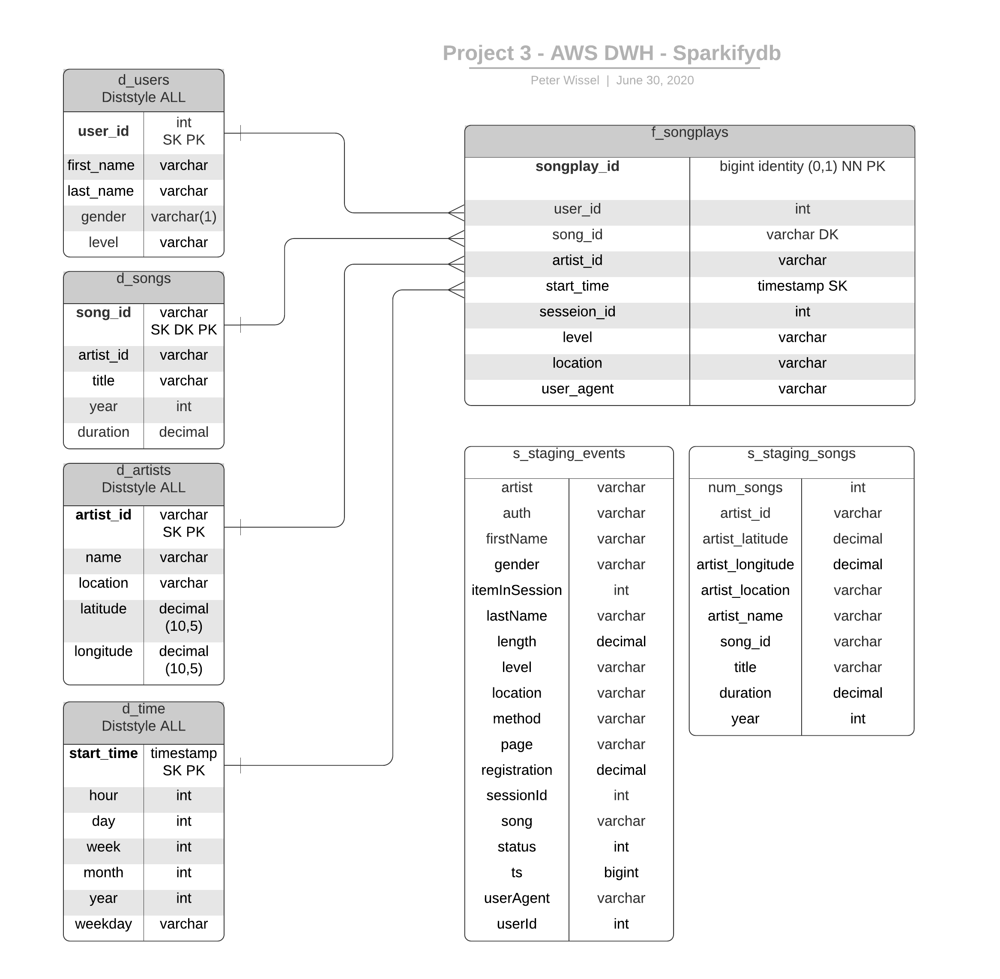

# Project: Data Warehouse on AWS
> by Peter Wissel
>> 2020-06-30

## Introduction
A music streaming startup, Sparkify, has grown their user base and song database and want to move their processes and 
data onto the cloud. Their data resides in S3, in a directory of JSON logs on user activity on the app, as well as a 
directory with JSON metadata on the songs in their app.

As their data engineer, I'am tasked with building an ETL pipeline that extracts their data from S3, stages them in 
Redshift, and transforms data into a set of dimensional tables for their analytics team to continue finding insights in 
what songs their users are listening to. I'am able to test the database and ETL pipeline by running queries given 
to me by the analytics team from Sparkify and compare my results with their expected results.

## Project Description
In this project, I'll apply what I've learned on data warehouses and AWS to build an ETL pipeline for a database 
hosted on Redshift. To complete the project, I'll need to load data from S3 to staging tables on Redshift and 
execute SQL statements that create the analytics tables from these staging tables.

# Project Datasets

I'll be working with two datasets that reside in S3. Here are the S3 links for each:

    Song data         : s3://udacity-dend/song_data
    Log data          : s3://udacity-dend/log_data
    Log data json path: s3://udacity-dend/log_json_path.json

## Song Dataset

The first dataset is a subset of real data from the Million Song Dataset. Each file is in JSON format and contains 
metadata about a song and the artist of that song. The files are partitioned by the first three letters of each song's 
track ID. For example, here are filepaths to two files in this dataset.

    song_data/A/B/C/TRABCEI128F424C983.json
    song_data/A/A/B/TRAABJL12903CDCF1A.json

And below is an example of what a single song file, `TRAABJL12903CDCF1A.json`, looks like.

    {"num_songs": 1, "artist_id": "ARJIE2Y1187B994AB7", "artist_latitude": null, "artist_longitude": null, "artist_location": "", "artist_name": "Line Renaud", "song_id": "SOUPIRU12A6D4FA1E1", "title": "Der Kleine Dompfaff", "duration": 152.92036, "year": 0}

## Log Dataset

The second dataset consists of log files in JSON format generated by this event simulator based on the songs in the 
dataset above. These simulate app activity logs from an imaginary music streaming app based on configuration settings.

The log files in the dataset I'll be working with are partitioned by year and month. For example, here are filepaths 
to two files in this dataset.

    log_data/2018/11/2018-11-12-events.json
    log_data/2018/11/2018-11-13-events.json

And below is an example of what the data in a log file, `2018-11-12-events.json`, looks like.

# Files

In addition to the data files, the project includes seven files:

1. `README.md` provides an introduction to this project.

2. `IaC.ipynb` is a jupyter notebook which creates a AWS Redshift cluster based on the "Infrastructure as Code (IaC)" 
architecture.  

3. `dwh.cfg` contains the whole configuration parameters of this project.

4. `create_tables.py`drops and creates tables. I run this file to reset my tables before each time I run the ETL 
    scripts.
    
5. `etl.py` reads and processes files from song_data and log_data and loads them into the tables.

6. `sql_queries.py` contains all my sql queries, and is imported into the last two files above.

7. `execution_log.txt` contains log entries from `create_tables.py` and  `etl.py`. This was done to measure the 
execution time.

# Database Schema for Song Play Analysis

For fast aggregation and simplified queries for the songplay analysis I created a denormalized star schema, based on the 
song and log datasets. This includes one fact table on songplays (`f_songplays`) and four dimension tables for users 
(`d_users`), songs (`d_songs`), artists (`d_artists`) and time (`d_time`). The two staging tables (`s_staging_events`, 
`s_staging_songs`) are used as a target in Redshift to copy log and song data from S3 Data Lake into Redshift DWH.  
  

# ETL Pipeline

### What stands ETL for?
**ETL** stands for **E**xtract **T**ransform and **L**oad which is the general procedure to copy source data into a 
destination system which represents the data differently from, or in a different context than, the sources.

## How are the files executed

1. Execute all commands of the `IaC.ipynb` file in the Jupyter Notebook to create an AWS Redshift cluster including all 
permissions and security settings. An IAM ROLE is also generated. 

2. The next file `create_tables.py` prepares the database environment for a schema called "project3" and switches the 
search to it. After this step existing tables will be dropped to prepare a clean database. The procedure `create_tables()` 
will create the staging tables (`s_staging_events`, `s_staging_songs`), dimensions (`d_users`, `d_songs`, `d_artists`, 
`d_time`) and the fact table (`f_songplays`). 

3. In step three, the data from the Amazon S3 data lake is copied into the prepared staging tables after the 
procedure (`check_if_data_resides_in_S3()` ) has checked the existence of the data to be loaded. In the 
***T***ransformation and ***L***oading step, the data is transferred to the final fact and dimension tables.

4. The procedure `clean_up_after_processing_step()` drops the staging tables and gives the user some hints for a more 
performing Redshift database.

5. As a example for an execution log the file `execution_log.txt` shows the log entries from `create_tables.py` and  `etl.py`. This was done to measure the 
execution time.